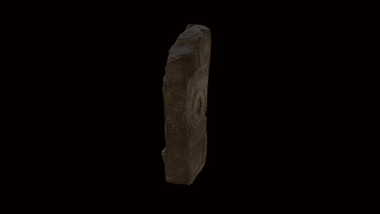

 

# A 3D model of a stele/winepress

3D data for recreation of a British Museum object.

Basalt stela; on the front is a relief of Antiochus I Epiphanes greeting the nude Herakles-Verethragna as his equal and proferring his right hand in a Dexiosis scene; king shown wearing a belted tunic, cloak, high decorated tiara or kitaris (an adaptation of the Armenian tiara) and, on the right hip, a four-lobed dagger; Herakles-Verethragna carries his club and the skin of the Nemean lion. On the two sides and back, a late Greek inscription referring to cult practices established by Antiochus; in the centre is a hole, illustrating the object’s later re-use as an oil-press.

# LICENSE
The contents of this repository are licensed under CC-BY-NC-SA

# Credits
Photographs and models by Daniel Pett <dpett@britishmuseum.org>, Digital Humanities Lead, British Museum

Copyright Trustees of the British Museum
